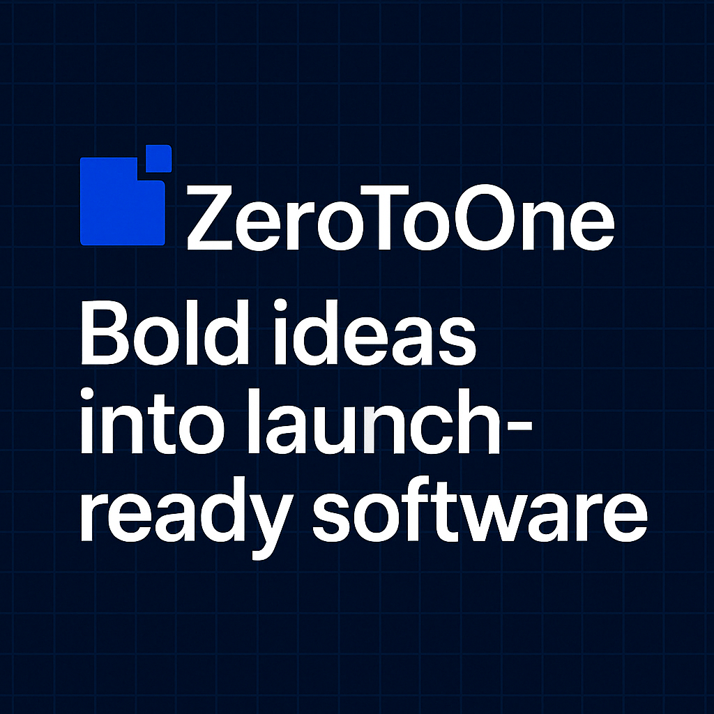

# ZeroToOne

**We help visionaries turn raw ideas into real, working products — designed to impress, built to scale, and ready to launch.**

Welcome to the official GitHub organization for **ZeroToOne** — a design-and-build studio for bold software founders. Here you'll find production-grade codebases, polished component libraries, and internal tools that support everything from MVP launches to growth-ready infrastructure.

---

## Our Mission

We exist to bridge the gap between idea and execution. Whether it's the first commit or the final deploy, we focus on clarity, craft, and confidence — giving founders everything they need to ship fast and scale smart.

---

## Key Repositories

| Project | Description | Status |
|--------|-------------|--------|
| [`zerotoone-site`](https://github.com/ZeroToOne/zerotoone-site) | Our official website — includes scroll-animated timelines, motion-enhanced sections, and interactive product demos | `LIVE` |
| [`davinci`](https://github.com/ZeroToOne/davinci) | A modern inspection and reporting platform with custom PDF exports, annotation tools, and dynamic form builders | `IN USE` |
| [`motion-utils`](https://github.com/ZeroToOne/motion-utils) | Reusable motion components and animation helpers powered by Framer Motion | `WIP` |
| [`zero-to-mvp`](https://github.com/ZeroToOne/zero-to-mvp) | Starter kit and checklist for launching a SaaS MVP in 60 days — includes lead magnet downloads, landing page, and email funnel | `READY` |
| [`zero-to-one-mvp-ui-kit`](https://github.com/ZeroToOne/zero-to-one-mvp-ui-kit) | **MVP-ready React libraries** — includes component kit, onboarding wizard, and styled PDF preview | `NEW` |

---

## How We Work

- **Speed Meets Substance**: We move fast, but never cut corners.  
- **Modular by Default**: Every component is designed for reuse and clarity.  
- **WOW Moments Matter**: Our products don’t just work — they impress.

---

## Technologies We Love

`Ruby on Rails` · `TailwindCSS` · `StimulusJS` · `Framer Motion` · `Next.js`  
`TypeScript` · `Stripe` · `Grover` · `SVG Animation` · `Turbo`

---

## Get Involved

If you're a founder, builder, or curious dev, feel free to:

- Fork our starter kits and tools  
- Drop feedback via GitHub Issues  
- Watch our main repos for updates  
- Join the waitlist for early access tools (coming soon)

---

## Brand Values

> “We turn bold ideas into launch-ready software.”

- **Clarity Over Complexity**  
- **Partners, Not Vendors**  
- **Outcomes, Not Outputs**

---

## Featured Components

- `<ProductBuildSimulator />` – Scroll-activated product mock builder with confetti and toast logic  
- `<ComparePlansTable />` – Swipeable mobile-first pricing table with hover badges and popovers  
- `<FloatingCTA />` – Sticky action button with scroll-trigger logic  
- `<WhatYouGet />` – Animated phase cards with expandable details

> Want a full demo? Visit [zerotoone.so](https://zerotoone.so)

---

## License

All code in public repos is MIT licensed unless otherwise noted. Please check individual projects for license details.

---

## Let’s Build Something Unreal

From idea to launch — this is how we go from **Zero → One**.
